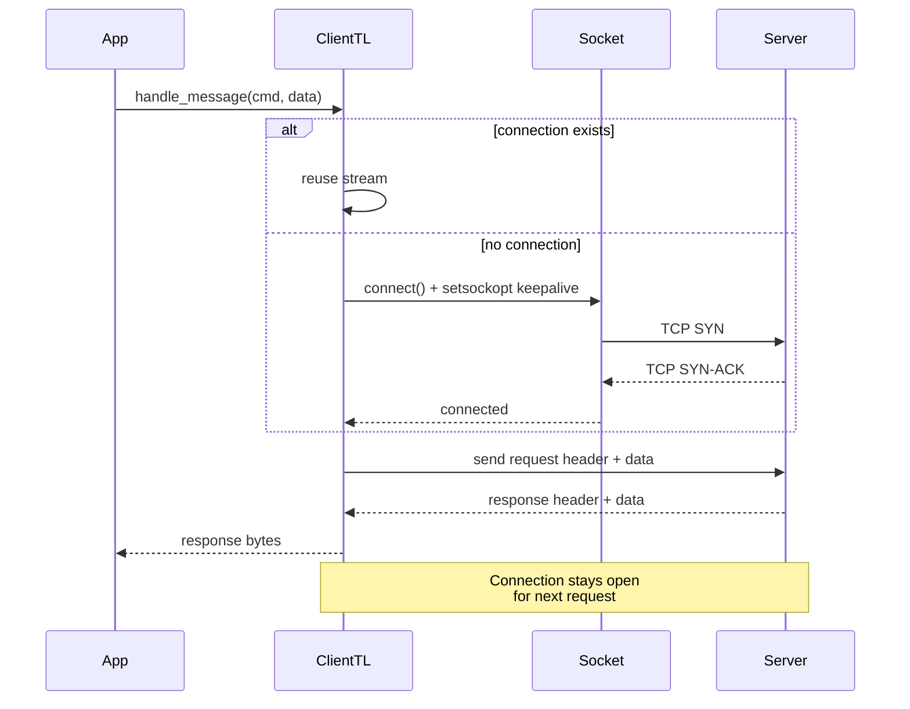

# wagonet Keep-Alive Architecture

## Overview
The keep-alive feature allows clients to reuse TCP/TLS connections across multiple request/response cycles, reducing connection overhead for high-frequency workloads.

## Component Diagram

```mermaid
graph TB
    subgraph Client["Client Application"]
        App[Application Code]
        TL[ClientTL / ClientTLS]
        Config[TimeoutConfig + KeepAliveConfig]
    end

    subgraph Transport["Transport Layer"]
        Socket[(socket2::TcpKeepalive)]
        TcpStream[tokio::net::TcpStream]
        TlsStream[tokio_native_tls::TlsStream]
    end

    subgraph Network["Network"]
        Server[(Server)]
    end

    App -->|handle_message()| TL
    TL -->|set_timeout_config()| Config
    Config -->|keep_alive: Option<KeepAliveConfig>| TL
    
    TL -.->|keep_alive=true| Socket
    Socket -->|setsockopt TCP_KEEPIDLE<br/>TCP_KEEPINTVL| TcpStream
    TL -->|new connection| TcpStream
    TL -->|TLS handshake| TlsStream
    TlsStream -->|encrypted| TcpStream
    TcpStream <-->|TCP packets| Server

    TL -.->|keep_alive=false| TcpStream
    TcpStream -.->|single request<br/>then shutdown| Server
```

## Connection Lifecycle

```mermaid
stateDiagram-v2
    [*] --> Created: ClientTL::new() / ClientTLS::new()
    Created --> Connecting: handle_message() or connect()
    Connecting --> Connected: TCP connect + optional TLS
    Connected --> Connected: keep_alive=true & handle_message()
    Connected --> Disconnecting: keep_alive=false & handle_message() done
    Connected --> Disconnecting: disconnect() called
    Connected --> Connecting: retry on failure (keep_alive=true)
    Disconnecting --> Disconnected: shutdown() + stream=None
    Disconnected --> [*]
```

## Request/Response Flow (keep_alive=true)



## Error Handling & Retry Logic

```mermaid
flowchart TD
    Start[handle_message called] --> Connected{keep_alive && stream.is_some?}
    Connected -->|Yes| Reuse[Reuse existing connection]
    Connected -->|No| Connect[connect()]
    Reuse --> SendRecv[try_send_receive]
    Connect --> SendRecv
    SendRecv --> Success{OK?}
    Success -->|Yes| Return[Return response]
    Success -->|No & keep_alive| Retry[stream=None, connect(), retry once]
    Success -->|No & !keep_alive| Error[Return error]
    Retry --> Success2{OK?}
    Success2 -->|Yes| Return
    Success2 -->|No| Error2[Return error]
```

## Key Implementation Details

### TCP Keep-Alive Configuration
```rust
// socket2::TcpKeepalive
let tcp_keepalive = TcpKeepalive::new()
    .with_time(ka.time)        // TCP_KEEPIDLE: idle time before first probe
    .with_interval(ka.interval); // TCP_KEEPINTVL: interval between probes
// Note: TCP_KEEPCNT (retries) not exposed in socket2 0.5
```

### Configuration Structure
```rust
pub struct KeepAliveConfig {
    pub time: Duration,      // default: 30s
    pub interval: Duration,  // default: 10s
}

pub struct TimeoutConfig {
    pub connect: Duration,
    pub read_header: Duration,
    pub read_data: Duration,
    pub write: Duration,
    pub keep_alive: Option<KeepAliveConfig>, // None = OS defaults
}
```

### Usage Example
```rust
let mut client = ClientTL::new("127.0.0.1:8080".to_string());
client.set_keep_alive(true);
client.set_timeout_config(TimeoutConfig {
    keep_alive: Some(KeepAliveConfig {
        time: Duration::from_secs(60),
        interval: Duration::from_secs(15),
    }),
    ..Default::default()
});

// Multiple requests reuse same connection
let resp1 = client.handle_message(1, b"hello").await?;
let resp2 = client.handle_message(2, b"world").await?;
```

## Security Considerations

1. **TLS Validation**: `ClientTLS::new()` defaults to `accept_invalid_certs: false` - certificate validation enabled by default
2. **No Health-Check Byte Consumption**: Removed problematic health-check that consumed wire bytes
3. **Bounded Retries**: Maximum 1 retry on failure, no infinite loops
4. **Resource Cleanup**: `disconnect()` clears stream on both success and error paths
5. **No Secrets in Logs**: All logging uses fixed strings and error codes only